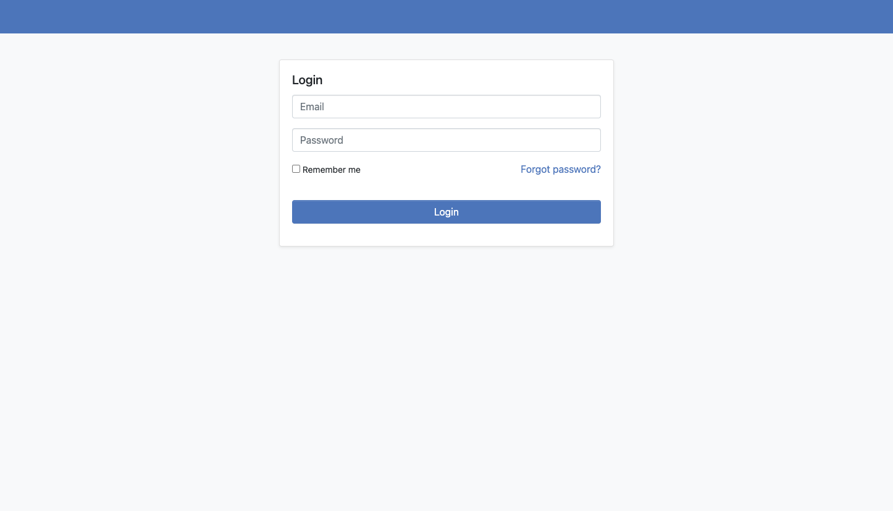
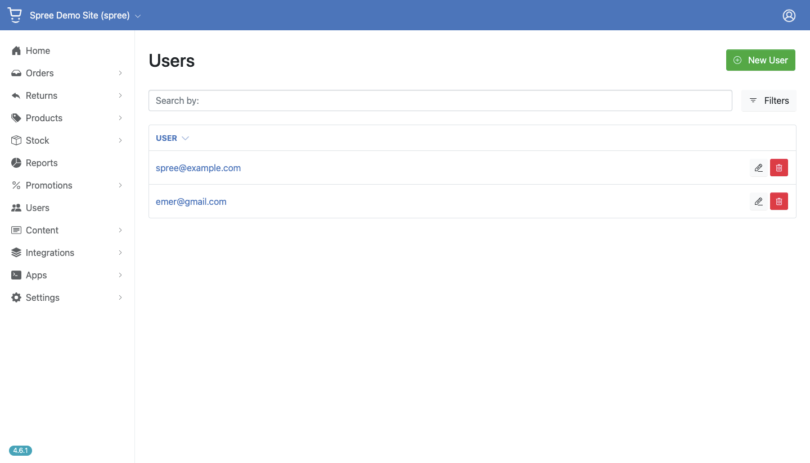
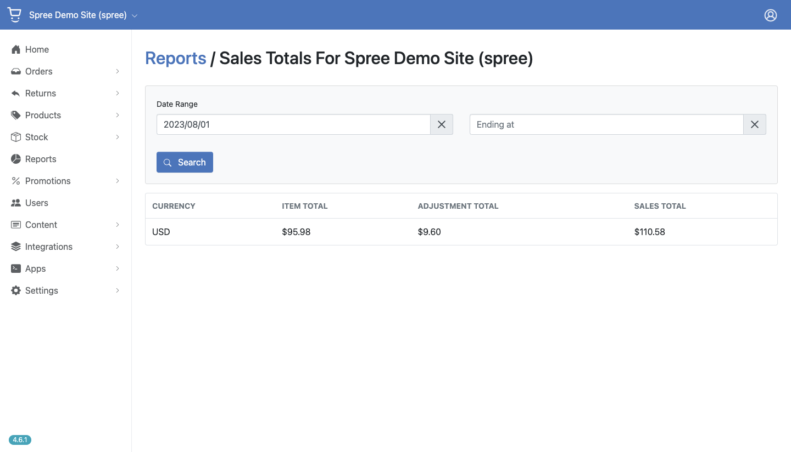

# Ecommerce con Spree 
## requerimientos minimos 
<ul>
  <li>ruby 3.2.1</li>
  <li>Rails 7.0.7.2</li>
</ul>

## para levantar el proyecto 
### clonar el proyecto 
```bash
git clone 
```
### ubicarse dentro del proyecto 
```bash
cd nombre_proyecto
```
### instalar todas las gemas 
```bash
bundle install
```
### crear la base de datos 
```bash
rails db:create
```
### migrar toda la base de datos 
```bash
rails db:migrate
```
### correr el servidor 
```bash
rails s
```

## demo tienda online
### iniciar sesión
<ul>
  <li> <strong> usuario: </strong> spree@example.com </li>
  <li> <strong> contraseña: </strong> spree123 </li>
</ul>


### registrar usuarios 


### reporte ventas


